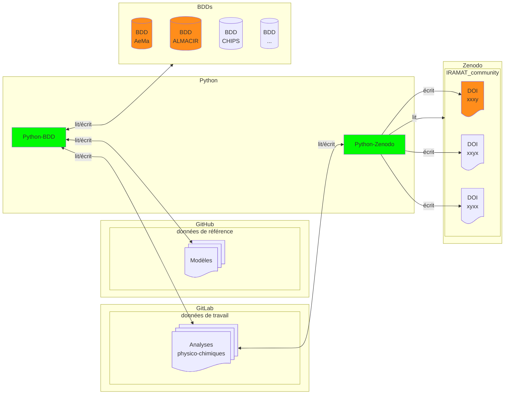

# Analyses physico-chimiques

: numismatique (lié à la)  
: code informatique 

## Explications

### données

#### Analyses physico-chimiques (fichier)

Données de travail (≠ données de référence) hebergées sur GitLab. Un fichier tabulaire CSV avec l'ensemble des champs possibles[^1] pour les résultats des analyses MEB-EDS, Raman, XRF, etc. En anglais et par exemple (voir aussi [analysis_results.tsv](https://github.com/zoometh/iramat-test/blob/main/dbs/analysis_results.tsv)).

| nom colonne             | type de donées | description |
|--------------------------|----------|----------|
| Iramat_ID               | STRING   | Identifiant laboratoire, suggestion: IRAMAT-XXXX (sur *n*-digit), auto-incrémenation |
| Sample_ID               | STRING   | Identifiant analyse |
| Analysis_Type           | STRING   | MEB-EDS, Gamma Spectroscopy, Raman, etc. |
| Element/Isotope         | STRING   | Élément (pour MEB-EDS) ou isotope (pour spectroscopie gamma) analysé |
| Concentration/Activity  | FLOAT    | Valeur mesurée (par exemple, concentration élémentaire ou activité radioactive) |
| Unit                    | STRING   | Unité de mesure (par exemple, %, ppm, Bq, keV) |
| Wavelength (cm⁻¹)       | FLOAT    | Uniquement pour l'analyse Raman, la position du pic dans le décalage Raman |
| Intensity               | FLOAT    | Intensité du pic Raman ou autres caractéristiques spectrales |
| Uncertainty             | FLOAT    | Incertitude de mesure |
| Date_Analyzed           | DATE     | Date à laquelle l'analyse a été réalisée |
| Comments                | STRING   | Observations ou métadonnées supplémentaires |
| ...                | ...   | ... |

#### Python

* Python-BDD:

Lit dans les différentes BDD

* Python-Zenodo

Lit le fichier Analyses physico-chimiques (filtrage, tri, aggrégation) et écrit dans la communauté IRAMAT de Zenodo

##### lit/écrit
> lire/écrire

Gérés par des scripts Python (fonctions, Jupyter NB, packages) qui effectuent:

1. Connection aux BDD ([exemple](https://colab.research.google.com/drive/1EHUO9JaBNLIyNdiHLCTtPAODgFhEvgcq?usp=sharing))
2. mappage des données (i.e. alignement des données BDD et )
3. vérifications des types et de la cohérence des données 

[^1] Possiblement de très nombreuses lignes et colonnes avec beaucoup de données manquantes, champs vides, etc. N'est pas destiné à être lu par des humains mais par des scripts informatiques (filtrage, tri, aggrégation) et restitué à la volée