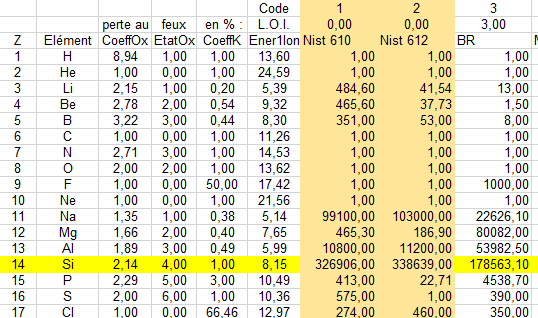

## Modèle conceptuel

Deux possibilités: (1) une BDD ou (2) plusieurs BDDs

  
   
    Légende

### Une seule BDD

  
   
    MCD avec une seule BDD

### Plusieurs BDDs

  
   
    MCD avec une plusieurs BDDs

## Lexique

### Données

#### Données de référence
> modèle de données, *templates*

Plusieurs fichiers des données de référence (≠ données de travail) hebergés sur GitHub et sur le site de l'IRAMAT (publiques). Format mixte (CSV, RDF, JSON, etc.) aligné sur les standards et isostandards (ex: CRMsci). Modèles, *templates*, tableau de calibration, matériaux de référence (obsidienne, verre), etc., qui à moyen terme peuvent fournir des standards de référence qui seront réutilisés par la communauté des archéomètres. 

#### documentation

  
   
    screenshot de `C:\Users\TH282424\Rprojects\iramat-test\doc\references_orleans.xlsx`

* [CAIRN-Matériauthèques et Bases de données en Archéométrie](https://archeometrie.cnrs.fr/vers-lelaboration-et-le-partage-dun-thesaurus-et-dun-schema-conceptuel-de-donnees-de-materiautheque/)

### Données de travail

Les données brutes, données agrégées, etc., qui sont issues d'outils de mesure et qui serviront à l'analyse statistique.

