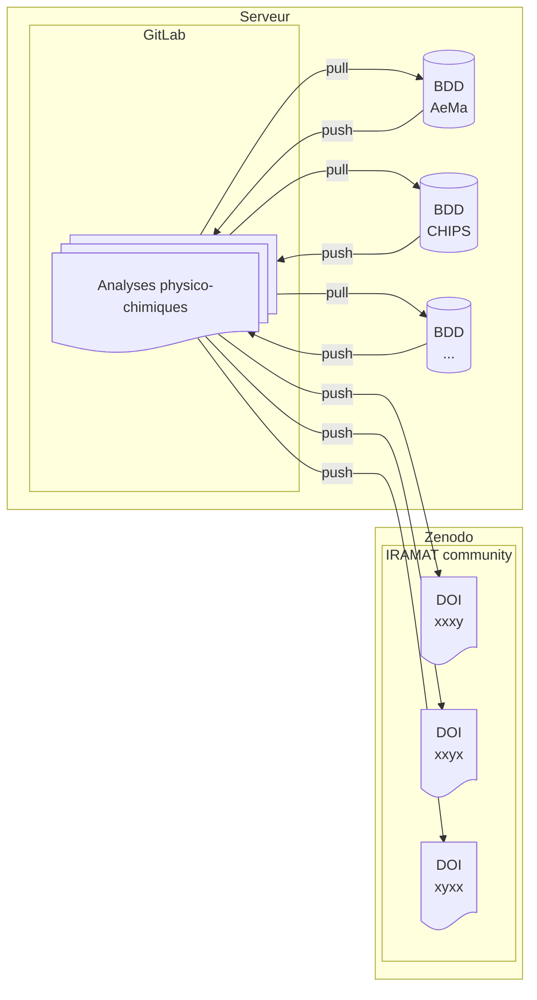

## Analyses physico-chimiques

```mermaid
flowchart LR
subgraph Serveur
    subgraph GitLab
        A@{ shape: docs, label: "Analyses physico-chimiques" }
    end
    A -- pull --> B[(BDD<br>AeMa)];
    A -- pull --> C[(BDD<br>CHIPS)];
    A -- pull --> D[(BDD<br>...)];
    B -- push --> A;
    C -- push --> A;
    D -- push --> A;
end
subgraph Zenodo
    subgraph IRAMAT community
        A -- push --> E@{ shape: doc, label: "DOI<br>xxxy" }
        A -- push --> F@{ shape: doc, label: "DOI<br>xxyx" }
        A -- push --> G@{ shape: doc, label: "DOI<br>xyxx" }
    end
end

click A "https://github.com/eamena-project/eamena-arches-dev/tree/main/dbs/database.eamena/data/reference_data#erd" _blank
```