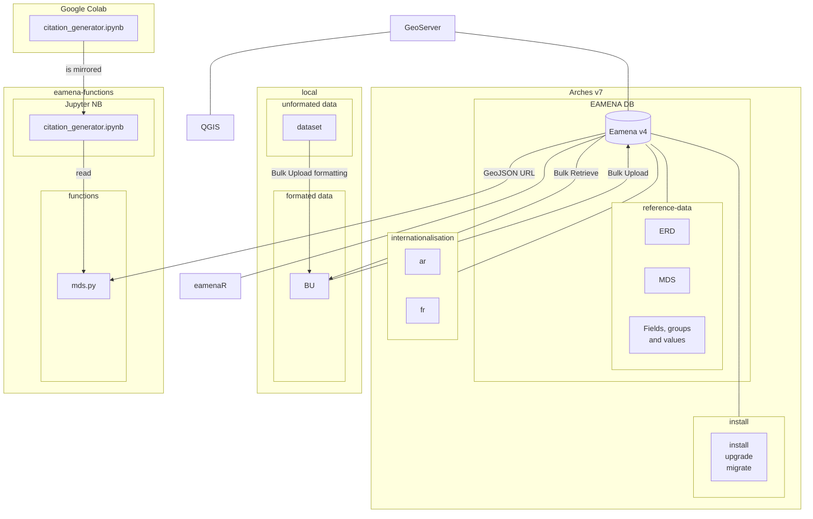

## Analyses physico-chimiques

```mermaid
flowchart
  subgraph Arches v7
    subgraph EAMENA DB
      ea[(Eamena v4)];
      subgraph reference-data
        idr1[ERD];
        idr2[MDS];
        idr3[Fields, groups<br>and values];
      end
    end
    subgraph internationalisation
      id6[ar];
      id7[fr];
    end 
    subgraph install
      id8[install<br>upgrade<br>migrate];
    end 
  end
  id3[GeoServer] --- ea;
  id3 --- id4[QGIS];
  subgraph local
    direction TB
    subgraph unformated data
      id9A[dataset]
    end
    subgraph formated data
      direction TB
      id9A -- Bulk Upload formatting --> id9B[BU];
      id9B -- Bulk Upload --> ea;
      ea -- Bulk Retrieve --> id9B;
    end
  end
  subgraph eamena-functions
    direction LR
    subgraph functions
      idf1[mds.py]
    end
    subgraph Jupyter NB
      idf2[citation_generator.ipynb] -- read --> idf1
    end
  end
  subgraph Google Colab
    idg1[citation_generator.ipynb] -- is mirrored --> idf2
  end
  ea -- GeoJSON URL --> idf1
  ea --- id5[eamenaR];
  ea --- internationalisation
  ea --- reference-data
  ea <--- install

  click idr1 "https://github.com/eamena-project/eamena-arches-dev/tree/main/dbs/database.eamena/data/reference_data#erd" _blank
  click idr2 "https://github.com/eamena-project/eamena-arches-dev/tree/main/dbs/database.eamena/data/reference_data#mds" _blank
  click idr3 "https://github.com/eamena-project/eamena-arches-dev/tree/main/dbs/database.eamena/data/reference_data#groups-of-fields-fields-and-field-values-descriptions" _blank
  click id6 "https://github.com/eamena-project/eamena-arches-dev/tree/main/dbs/database.eamena/internationalisation" _blank
  click id7 "https://github.com/eamena-project/eamena-arches-dev/tree/main/dbs/database.eamena/internationalisation" _blank
  click id8 "https://github.com/eamena-project/eamena-arches-dev/tree/main/dbs/database.eamena/install" _blank
  click id3 "https://github.com/eamena-project/eamena-arches-dev/tree/main/geoserver" _blank
  click id4 "https://github.com/eamena-project/eamena-arches-dev/tree/main/gis/qgis" _blank
  click idf1 "https://github.com/eamena-project/eamena-functions/blob/main/mds/mds.py" _blank
  click idf2 "https://github.com/eamena-project/eamena-arches-dev/blob/main/dev/citations/citation_generator.ipynb" _blank
  click idg1 "https://colab.research.google.com/github/eamena-project/eamena-arches-dev/blob/main/dev/citations/citation_generator.ipynb" _blank
  click id5 "https://github.com/eamena-project/eamenaR" _blank
  click id9B "https://github.com/eamena-project/eamena-arches-dev/tree/main/data/bulk#readme" _blank
```