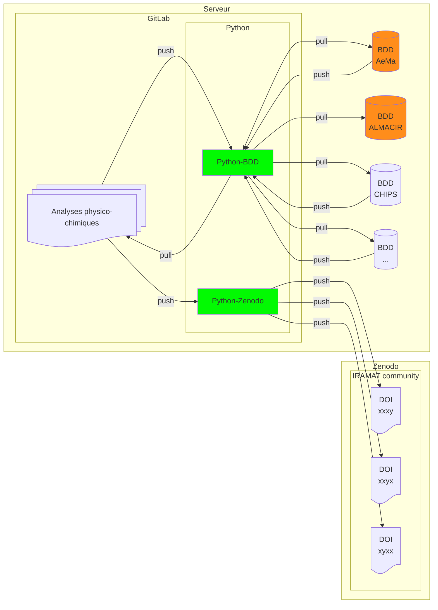

## Analyses physico-chimiques

: numismatique 
: code informatique 

### Explications

#### données

##### Analyses physico-chimiques

Un fichier tabulaire avec l'ensemble des champs possibles pour les résultats des analyses MEB-EDS, Raman, XRF, etc. En anglais et par exemple (voir aussi [analysis_results.tsv](https://github.com/zoometh/iramat-test/blob/main/dbs/analysis_results.tsv)).

| nom colonne             | type de donées | description |
|--------------------------|----------|----------|
| Iramat_ID               | STRING   | Identifiant laboratoire, suggestion: IRAMAT-XXXX (sur *n*-digit) |
| Sample_ID               | STRING   | Identifiant analyse |
| Analysis_Type           | STRING   | MEB-EDS, Gamma Spectroscopy, Raman, etc. |
| Element/Isotope         | STRING   | Élément (pour MEB-EDS) ou isotope (pour spectroscopie gamma) analysé |
| Concentration/Activity  | FLOAT    | Valeur mesurée (par exemple, concentration élémentaire ou activité radioactive) |
| Unit                    | STRING   | Unité de mesure (par exemple, %, ppm, Bq, keV) |
| Wavelength (cm⁻¹)       | FLOAT    | Uniquement pour l'analyse Raman, la position du pic dans le décalage Raman |
| Intensity               | FLOAT    | Intensité du pic Raman ou autres caractéristiques spectrales |
| Uncertainty             | FLOAT    | Incertitude de mesure |
| Date_Analyzed           | DATE     | Date à laquelle l'analyse a été réalisée |
| Comments                | STRING   | Observations ou métadonnées supplémentaires |
| ...                | ...   | ... |

##### Pull et Push

Gérés par des scripts Python (fonctions, Jupyter NB, packages) qui effectuent:

1. mappage des données
2. vérifications des types et de la cohérence des données 

##### Pull et Push

