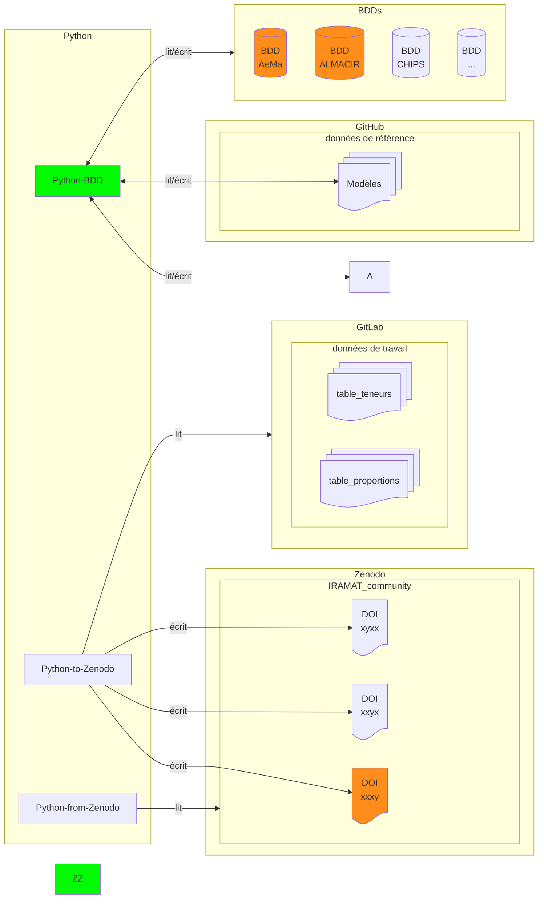

# Analyses physico-chimiques

## table_teneurs

| Column Name         | Data Type | Constraints         | Description       |
|---------------------|-----------|---------------------|-------------------|
| id_labo              | string   |                     |   Identifiant laboratoire, suggestion: IRAMAT-XXXX (sur *n*-digit), auto-incrémenation               |
| id_ech              | integer   |                     |   Identifiant échantillon               |
| id_analyse          | integer   |                     |   Identifiant analyse               |
| id_machine          | integer   |                     |   Identifiant machine               |
| ag                  | numeric   |                     | Silver (Ag)       |
| al                  | numeric   |                     | Aluminum (Al)     |
| as             | numeric   |                     | Arsenic (As)     |
| ba                  | numeric   |                     | Barium (Ba)      |
| be                  | numeric   |                     | Beryllium (Be)   |
| bi                  | numeric   |                     | Bismuth (Bi)     |
| c                   | numeric   |                     | Carbon (C)       |
| cd                  | numeric   |                     | Cadmium (Cd)     |
| ce                  | numeric   |                     | Cerium (Ce)      |
| co                  | numeric   |                     | Cobalt (Co)      |
| cr                  | numeric   |                     | Chromium (Cr)    |
| cs                  | numeric   |                     | Cesium (Cs)      |
| cu                  | numeric   |                     | Copper (Cu)      |
| dy                  | numeric   |                     | Dysprosium (Dy)  |
| er                  | numeric   |                     | Erbium (Er)      |
| eu                  | numeric   |                     | Europium (Eu)    |
| fe                  | numeric   |                     | Iron (Fe)        |
| fe56delta           | numeric   |                     | Delta Fe-56      |
| fe57delta           | numeric   |                     | Delta Fe-57      |
| ga                  | numeric   |                     | Gallium (Ga)     |
| gd                  | numeric   |                     | Gadolinium (Gd)  |
| ge                  | numeric   |                     | Germanium (Ge)   |
| hf                  | numeric   |                     | Hafnium (Hf)     |
| ho                  | numeric   |                     | Holmium (Ho)     |
| in                  | numeric   |                     | Indium (In)      |
| k                   | numeric   |                     | Potassium (K)    |
| la                  | numeric   |                     | Lanthanum (La)   |
| li                  | numeric   |                     | Lithium (Li)     |
| lu                  | numeric   |                     | Lutetium (Lu)    |
| mg                  | numeric   |                     | Magnesium (Mg)   |
| mn                  | numeric   |                     | Manganese (Mn)   |
| mo                  | numeric   |                     | Molybdenum (Mo)  |
| na                  | numeric   |                     | Sodium (Na)      |
| nb                  | numeric   |                     | Niobium (Nb)     |
| nd                  | numeric   |                     | Neodymium (Nd)   |
| ni                  | numeric   |                     | Nickel (Ni)      |
| os                  | numeric   |                     | Osmium (Os), by ppt    |
| os187_os188         | numeric   |                     | Osmium Isotope Ratio (Os-187/Os-188) |
| os187_os186         | numeric   |                     | Osmium Isotope Ratio (Os-187/Os-186) |
| pb                  | numeric   |                     | Lead (Pb)        |
| pd                  | numeric   |                     | Palladium (Pd)   |
| pr                  | numeric   |                     | Praseodymium (Pr)|
| rb                  | numeric   |                     | Rubidium (Rb)    |
| ru                  | numeric   |                     | Ruthenium (Ru)   |
| sb                  | numeric   |                     | Antimony (Sb)    |
| sc                  | numeric   |                     | Scandium (Sc)    |
| se                  | numeric   |                     | Selenium (Se)    |
| si                  | numeric   |                     | Silicon (Si)     |
| sm                  | numeric   |                     | Samarium (Sm)    |
| sn                  | numeric   |                     | Tin (Sn)         |
| sr                  | numeric   |                     | Strontium (Sr)   |
| sr87_sr86           | numeric   |                     | Strontium Isotope Ratio (Sr-87/Sr-86) |
| ta                  | numeric   |                     | Tantalum (Ta)    |
| tb                  | numeric   |                     | Terbium (Tb)     |
| te                  | numeric   |                     | Tellurium (Te)   |
| th                  | numeric   |                     | Thorium (Th)     |
| ti                  | numeric   |                     | Titanium (Ti)    |
| tl                  | numeric   |                     | Thallium (Tl)    |
| tm                  | numeric   |                     | Thulium (Tm)     |
| u                   | numeric   |                     | Uranium (U)      |
| v                   | numeric   |                     | Vanadium (V)     |
| w                   | numeric   |                     | Tungsten (W)     |
| y                   | numeric   |                     | Yttrium (Y)      |
| yb                  | numeric   |                     | Ytterbium (Yb)   |
| zn                  | numeric   |                     | Zinc (Zn)        |
| zr                  | numeric   |                     | Zirconium (Zr)   |
| ...                  | ...   |                     | other elements   |
| ...                  | ...   |                     | other isotope ratio   |
| perte_feu           | numeric   |                     |  loss on ignition                |
| bibreference        | integer   |                     |                  |

## Flux de travail

: numismatique (lié à la)  
: code informatique 

## Explications

### données

#### Modéles

Plusieurs fichiers des données de référence (≠ données de travail) hebergés sur GitHub (publiques). Format mixte (CSV, RDF, JSON, etc.) aligné sur les standards et isostandards (ex: CRMsci).

#### Analyses
> Analyses physico-chimiques

Un seul fichier des données de travail (≠ données de référence), hebergé sur GitLab (privées). Format tabulaire CSV avec l'ensemble des champs possibles[^1] pour les résultats des analyses MEB-EDS, Raman, XRF, etc. En anglais et par exemple (voir aussi [analysis_results.tsv](https://github.com/zoometh/iramat-test/blob/main/dbs/analysis_results.tsv)).

| nom colonne             | type de donées | description |
|--------------------------|----------|----------|
| Iramat_ID               | STRING   | Identifiant laboratoire, suggestion: IRAMAT-XXXX (sur *n*-digit), auto-incrémenation |
| Analysis_ID             | STRING   | Identifiant analyse |
| Sample_ID               | STRING   | Identifiant échantillon |
| Analysis_Type           | STRING   | MEB-EDS, Gamma Spectroscopy, Raman, etc. |
| Element/Isotope         | STRING   | Élément (pour MEB-EDS) ou isotope (pour spectroscopie gamma) analysé |
| Concentration/Activity  | FLOAT    | Valeur mesurée (par exemple, concentration élémentaire ou activité radioactive) |
| Unit                    | STRING   | Unité de mesure (par exemple, %, ppm, Bq, keV) |
| Wavelength (cm⁻¹)       | FLOAT    | Uniquement pour l'analyse Raman, la position du pic dans le décalage Raman |
| Intensity               | FLOAT    | Intensité du pic Raman ou autres caractéristiques spectrales |
| Uncertainty             | FLOAT    | Incertitude de mesure |
| Date_Analyzed           | DATE     | Date à laquelle l'analyse a été réalisée |
| Comments                | STRING   | Observations ou métadonnées supplémentaires |
| ...                | ...   | ... |

#### Python

* Python-BDD:

Lit dans les différentes BDD

* Python-Zenodo

Lit le fichier Analyses physico-chimiques (filtrage, tri, aggrégation) et écrit dans la communauté IRAMAT de Zenodo

##### lit/écrit
> lire/écrire

Gérés par des scripts Python (fonctions, Jupyter NB, packages) qui effectuent:

1. Connection aux BDD ([exemple](https://colab.research.google.com/drive/1EHUO9JaBNLIyNdiHLCTtPAODgFhEvgcq?usp=sharing))
2. mappage des données (i.e. alignement des données BDD et )
3. vérifications des types et de la cohérence des données 

[^1] Possiblement de très nombreuses lignes et colonnes avec beaucoup de données manquantes, champs vides, etc. N'est pas destiné à être lu par des humains mais par des scripts informatiques (filtrage, tri, aggrégation) et restitué à la volée
