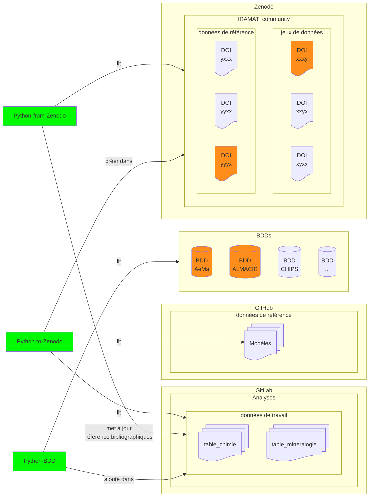
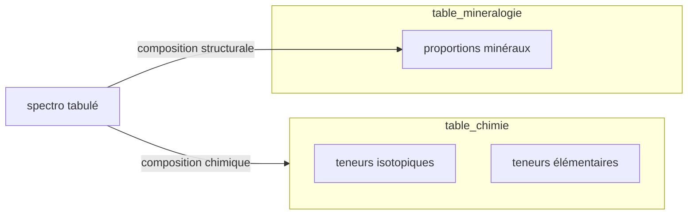

# Analyses physico-chimiques

## Flux de travail

: numismatique (lié à la)  
: code informatique 

### Données de travail

Les données brutes, données agrégées, etc., qui sont issues d'outils de mesure et qui serviront à l'analyse statistique.

#### table_chimie

Ci-dessous le modèle à discuter et [**ici** son aspect tableur (Google Sheet)](https://docs.google.com/spreadsheets/d/1MIQXiTlG1sYuCDRdMnEYfGmDcEa6tot5KfJeWaTQYZo/edit?usp=sharing)

| Column Name         | Data Type | Constraints         | Description       |
|---------------------|-----------|---------------------|-------------------|
| id_labo              | string   |                     |   Identifiant laboratoire, suggestion: IRAMAT-XXXX (sur *n*-digit), auto-incrémenation               |
| id_ech              | integer   |                     |   Identifiant échantillon               |
| id_analyse          | integer   |                     |   Identifiant analyse               |
| id_machine          | integer   |                     |   Identifiant machine               |
| **perc_ppm**         |  binomial  |                       | indique si les valeurs des colonnes suivantes sont en pourcentage (perc) ou en ppm   |
| ag                  | numeric   |                     | Silver (Ag)       |
| al                  | numeric   |                     | Aluminum (Al)     |
| as             | numeric   |                     | Arsenic (As)     |
| ba                  | numeric   |                     | Barium (Ba)      |
| be                  | numeric   |                     | Beryllium (Be)   |
| bi                  | numeric   |                     | Bismuth (Bi)     |
| c                   | numeric   |                     | Carbon (C)       |
| cd                  | numeric   |                     | Cadmium (Cd)     |
| ce                  | numeric   |                     | Cerium (Ce)      |
| co                  | numeric   |                     | Cobalt (Co)      |
| cr                  | numeric   |                     | Chromium (Cr)    |
| cs                  | numeric   |                     | Cesium (Cs)      |
| cu                  | numeric   |                     | Copper (Cu)      |
| dy                  | numeric   |                     | Dysprosium (Dy)  |
| er                  | numeric   |                     | Erbium (Er)      |
| eu                  | numeric   |                     | Europium (Eu)    |
| fe                  | numeric   |                     | Iron (Fe)        |
| fe56delta           | numeric   |                     | Delta Fe-56      |
| fe57delta           | numeric   |                     | Delta Fe-57      |
| ga                  | numeric   |                     | Gallium (Ga)     |
| gd                  | numeric   |                     | Gadolinium (Gd)  |
| ge                  | numeric   |                     | Germanium (Ge)   |
| hf                  | numeric   |                     | Hafnium (Hf)     |
| ho                  | numeric   |                     | Holmium (Ho)     |
| in                  | numeric   |                     | Indium (In)      |
| k                   | numeric   |                     | Potassium (K)    |
| la                  | numeric   |                     | Lanthanum (La)   |
| li                  | numeric   |                     | Lithium (Li)     |
| lu                  | numeric   |                     | Lutetium (Lu)    |
| mg                  | numeric   |                     | Magnesium (Mg)   |
| mn                  | numeric   |                     | Manganese (Mn)   |
| mo                  | numeric   |                     | Molybdenum (Mo)  |
| na                  | numeric   |                     | Sodium (Na)      |
| nb                  | numeric   |                     | Niobium (Nb)     |
| nd                  | numeric   |                     | Neodymium (Nd)   |
| ni                  | numeric   |                     | Nickel (Ni)      |
| os                  | numeric   |                     | Osmium (Os), by ppt    |
| os187_os188         | numeric   |                     | Osmium Isotope Ratio (Os-187/Os-188) |
| os187_os186         | numeric   |                     | Osmium Isotope Ratio (Os-187/Os-186) |
| pb                  | numeric   |                     | Lead (Pb)        |
| pd                  | numeric   |                     | Palladium (Pd)   |
| pr                  | numeric   |                     | Praseodymium (Pr)|
| rb                  | numeric   |                     | Rubidium (Rb)    |
| ru                  | numeric   |                     | Ruthenium (Ru)   |
| sb                  | numeric   |                     | Antimony (Sb)    |
| sc                  | numeric   |                     | Scandium (Sc)    |
| se                  | numeric   |                     | Selenium (Se)    |
| si                  | numeric   |                     | Silicon (Si)     |
| sm                  | numeric   |                     | Samarium (Sm)    |
| sn                  | numeric   |                     | Tin (Sn)         |
| sr                  | numeric   |                     | Strontium (Sr)   |
| sr87_sr86           | numeric   |                     | Strontium Isotope Ratio (Sr-87/Sr-86) |
| ta                  | numeric   |                     | Tantalum (Ta)    |
| tb                  | numeric   |                     | Terbium (Tb)     |
| te                  | numeric   |                     | Tellurium (Te)   |
| th                  | numeric   |                     | Thorium (Th)     |
| ti                  | numeric   |                     | Titanium (Ti)    |
| tl                  | numeric   |                     | Thallium (Tl)    |
| tm                  | numeric   |                     | Thulium (Tm)     |
| u                   | numeric   |                     | Uranium (U)      |
| v                   | numeric   |                     | Vanadium (V)     |
| w                   | numeric   |                     | Tungsten (W)     |
| y                   | numeric   |                     | Yttrium (Y)      |
| yb                  | numeric   |                     | Ytterbium (Yb)   |
| zn                  | numeric   |                     | Zinc (Zn)        |
| zr                  | numeric   |                     | Zirconium (Zr)   |
| ...                  | ...   |                     | other elements   |
| ...                  | ...   |                     | other isotope ratio   |
| perte_feu           | numeric   |                     |  loss on ignition                |
| bibreference        | integer   |                     |                  |

## Analyses
> Analyses physico-chimiques

Deux fichiers des données de travail (≠ données de référence), hebergés sur GitLab (privées). Format tabulaire CSV avec l'ensemble des champs possibles[^1]:

* pour les teneurs: [table_chimie](https://github.com/zoometh/iramat-test/tree/main/dbs#table_chimie)

* pour les proportions: table_mineralogie

## Code

Le code en back-end, et jusqu'à l'export des données de travail en CSV, se fait en Python (fonctions, Jupyter NB, packages). Le traitement statistique des données de travail exportées en CSV se fait avec un package R.
Le code Python permet: la connection aux BDD ([exemple](https://colab.research.google.com/drive/1EHUO9JaBNLIyNdiHLCTtPAODgFhEvgcq?usp=sharing)), mappage des données, vérifications des types et de la cohérence des données, ajout dans des fichiers ou des BDDs, etc. 

### Python-BDD:

Lit dans les différentes BDD. Effectue un 'mappage' des données BDD (i.e. alignement des données BDD) et ajoute à un fichier commun, [table_chimie](https://github.com/zoometh/iramat-test/tree/main/dbs#table_chimie) ou table_mineralogie, conservé dans le GitLab de l'IRAMAT.

### Python-from-Zenodo

Parcours la communauté IRAMAT (IRAMAT community) de Zenodo et relève toutes les metadata des fichiers (OAI-PMH). Met à jour les identifiants des fichiers sur GitLab.

### Python-to-Zenodo

Lit les données de référence herbergées sur GitHub et les données de travail hebergées sur GitLab. Ecrit dans la communauté IRAMAT de Zenodo (exemple dans la [sandbox](https://sandbox.zenodo.org/records/177235)). A la demande des chercheurs, pour exporter leur données depuis le GitLab du laboratoire vers Zenodo, communauté IRAMAT, afin d'avoir des DOI intéropérables attachés à leurs données supplémentaires. Lit le fichier [table_teneurs](https://github.com/zoometh/iramat-test/tree/main/dbs#table_teneurs) ou table_proportions, effectue des filtrages, tris, aggrégations (paramètres de la fonction Python) sur ces tables. Des données en texte libre (titre du jeu de données, description, affiliation de l'auteur, contributeurs, etc.) sont à saisir par le chercheur. 

#### Alignement des références BibTeX sur les entrées Zenodo

voir: 

1. table d'alignement [bibtex2zenodo.tsv](https://github.com/zoometh/iramat-test/blob/main/projects/citation/bibtex2zenodo.tsv)
2. [Zenodo documentation](https://developers.zenodo.org/#depositions)
3. fonction [zn_metadata()](https://github.com/zoometh/iramat-test-functions/blob/2444bd1ee1519904da4fd621be3561396a284a73/chips.py#L104)

[^1]: Possiblement de très nombreuses lignes et colonnes avec beaucoup de données manquantes, champs vides, etc. N'est pas destiné à être lu par des humains mais par des scripts informatiques (filtrage, tri, aggrégation) et restitué à la volée