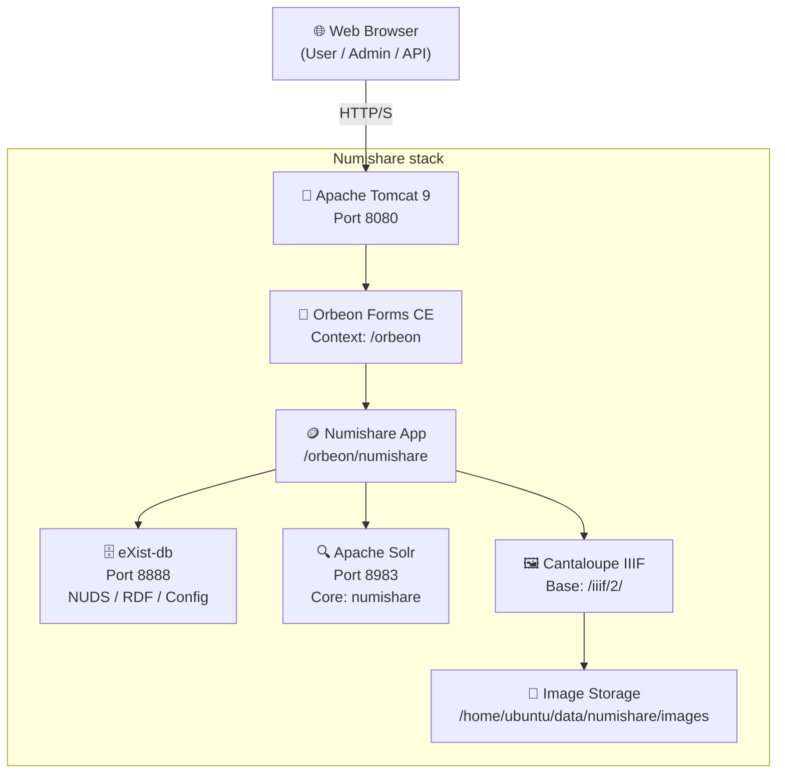

# Almacir

## Numishare

```mermaid
flowchart TB
    Browser["🌐 Web Browser<br/>(User / Admin / API)"]
	subgraph Numishare stack
    	Tomcat["🧱 Apache Tomcat 9<br/>Port 8080"]
    	Orbeon["📄 Orbeon Forms CE<br/>Context: /orbeon"]
    	Numishare["🪙 Numishare App<br/>/orbeon/numishare"]
   		Exist["🗄️ eXist-db<br/>Port 8888<br/>NUDS / RDF / Config"]
    	Solr["🔍 Apache Solr<br/>Port 8983<br/>Core: numishare"]
    	Cantaloupe["🖼️ Cantaloupe IIIF<br/>Base: /iiif/2/"]
    	Images["💾 Image Storage<br/>/home/ubuntu/data/numishare/images"]
	end

    Browser -->|HTTP/S| Tomcat
    Tomcat --> Orbeon
    Orbeon --> Numishare
    Numishare --> Exist
    Numishare --> Solr
    Numishare --> Cantaloupe
    Cantaloupe --> Images
```