# Almacir


## Numishare

### ERD
> Modèle conceptuel de données

```mermaid
flowchart TB
    Browser["🌐 Web Browser<br/>(User / Admin / API)"]
	subgraph Numishare stack
    	Tomcat["🧱 Apache Tomcat 9<br/>Port 8080"]
    	Orbeon["📄 Orbeon Forms CE<br/>Context: /orbeon"]
    	Numishare["🪙 Numishare App<br/>/orbeon/numishare"]
   		Exist["🗄️ eXist-db<br/>Port 8888<br/>NUDS / RDF / Config"]
    	Solr["🔍 Apache Solr<br/>Port 8983<br/>Core: numishare"]
    	Cantaloupe["🖼️ Cantaloupe IIIF<br/>Base: /iiif/2/"]
    	Images["💾 Image Storage<br/>/home/ubuntu/data/numishare/images"]
	end

    Browser -->|HTTP/S| Tomcat
    Tomcat --> Orbeon
    Orbeon --> Numishare
    Numishare --> Exist
    Numishare --> Solr
    Numishare --> Cantaloupe
    Cantaloupe --> Images
```



### Deployement
> Déploiement

# Numishare Deployment – Progress Checklist

## ✅ Completed

- [x] **Server & OS**
  - Ubuntu server provisioned
  - Java 17 installed (required by Orbeon 2023.x)
  - Technologies: Ubuntu, OpenJDK 17

- [x] **Apache Tomcat**
  - Tomcat 9 installed and running
  - Base URL: http://157.136.252.188:8080
  - Orbeon deployed as a webapp
  - Verified context resolution via `orbeon.xml`
  - Technologies: Apache Tomcat 9

- [x] **Orbeon Forms**
  - Orbeon Forms CE 2023.1 deployed
  - Base URLs:
    - http://157.136.252.188:8080/orbeon/
    - http://157.136.252.188:8080/orbeon/fr/
  - Custom `page-flow.xml` for Numishare correctly loaded
  - Numishare app mounted under `/orbeon/numishare`
  - Technologies: Orbeon Forms CE, XForms, XPL

- [x] **Numishare Application**
  - Numishare resources installed in:
    ```
    /var/lib/tomcat9/webapps/orbeon/WEB-INF/resources/apps/numishare/
    ```
  - `page-flow.xml` moved to correct location:
    ```
    apps/numishare/page-flow.xml
    ```
  - Admin interface reachable:
    - http://157.136.252.188:8080/orbeon/numishare/admin/
  - Known XPath role-handling bug fixed (GitHub issue #36)
    - All unsafe XPath expressions using `request-security/role`
    - Replaced with safe XPath using positional predicates
  - Technologies: Numishare, XPath, Saxon

- [x] **Authentication & Roles**
  - Tomcat user configured:
    - Role: `numishare-admin`
    - User: `ns-admin`
  - Orbeon role detection now stable (single-role environment)
  - Technologies: Tomcat security realms, BASIC auth

- [x] **eXist-db**
  - eXist-db running on Jetty
  - Base URL:
    - http://157.136.252.188:8888/exist/
    - Dashboard: http://157.136.252.188:8888/exist/apps/dashboard/admin
  - REST API verified:
    - http://localhost:8888/exist/rest/db/
  - Technologies: eXist-db, Jetty, XQuery

- [x] **Numishare Database Initialization**
  - `/db/numishare` collection created
  - `collections-list.xml` created and accessible:
    - http://localhost:8888/exist/rest/db/numishare/collections-list.xml
  - `demo` collection created:
    - `/db/numishare/demo`
  - `demo` collection now visible in Numishare admin UI
  - Technologies: eXist-db REST, Numishare XForms

- [x] **IIIF Image Server (Cantaloupe)**
  - Cantaloupe IIIF server installed and running
  - Image storage directory:
    ```
    /home/ubuntu/data/numishare/images
    ```
  - IIIF base URL:
    - http://157.136.252.188:8182/iiif/2
  - Example image verified:
    - http://157.136.252.188:8182/iiif/2/test.jpg/full/full/0/default.jpg
  - Technologies: Cantaloupe, IIIF Image API 2.1

---

## ⏳ To Do

- [ ] **Create initial Numishare collection configuration**
  - Create `config.xml` in:
    ```
    /db/numishare/demo/config.xml
    ```
  - Define:
    - collection type
    - IIIF image server URL
    - metadata settings
  - Technologies: eXist-db, Numishare config XML

- [ ] **Configure IIIF in Numishare**
  - Set `iiif_server` in `config.xml`
  - Verify image rendering in Numishare UI
  - Technologies: Numishare, IIIF

- [ ] **Initialize Solr (Search Index)**
  - Deploy Solr core for Numishare
  - Configure Numishare ↔ Solr connection
  - Run initial indexing
  - Technologies: Apache Solr

- [ ] **Create First Objects**
  - Create sample NUDS / coin records
  - Upload associated images
  - Verify IIIF image linking
  - Technologies: NUDS, XForms, IIIF

- [ ] **Permissions & Multi-User Setup (Optional)**
  - Define per-collection roles
  - Harden authentication
  - Technologies: Tomcat security, Numishare roles

- [ ] **Production Hardening**
  - HTTPS (reverse proxy or Tomcat SSL)
  - Backup strategy (eXist-db, images)
  - Monitoring and logs
  - Technologies: Nginx/Apache, systemd, backups

---

## 📌 Key URLs (Quick Reference)

- Tomcat:  
  http://157.136.252.188:8080

- Orbeon:  
  http://157.136.252.188:8080/orbeon/

- Numishare Admin:  
  http://157.136.252.188:8080/orbeon/numishare/admin/

- eXist-db Dashboard:  
  http://157.136.252.188:8888/exist/apps/dashboard/admin

- IIIF Server:  
  http://157.136.252.188:8182/iiif/2
