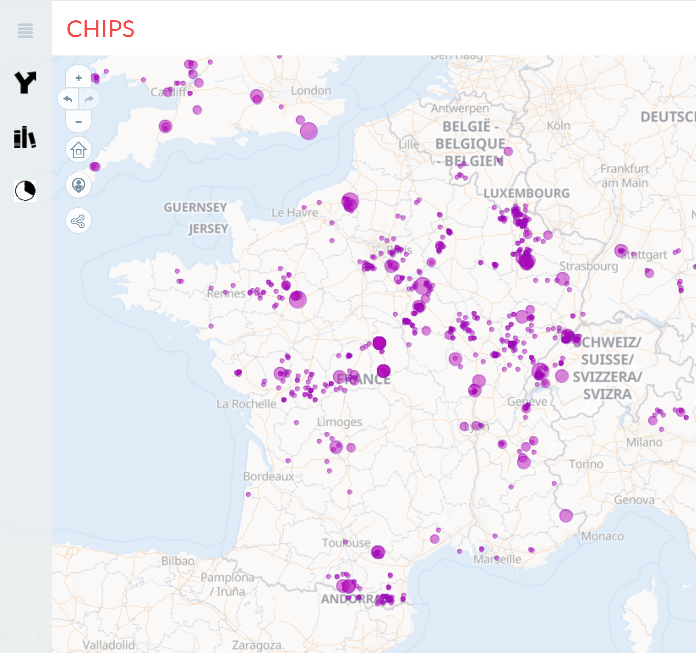

# CHIPS
> *CHImie en PaléoSidérurgie*

<p align="center">
  
  <br>
    <em>CHIPS le 18/02/25</em>
</p>

voir [Python Jupyter NB](https://colab.research.google.com/drive/1NGYTI85KgnVGFUy9PlF27nlwvJ1vgDde?hl=en)

## BD

Postgres

### Références bibliographiques

* ajouter

```sql
INSERT INTO _refbib (ref_table,ref_biblio)
VALUES ('instrument_incertitude','@techreport{Doe2024TechReport,
  author      = {John Doe and Jane Smith},
  title       = {A Comprehensive Guide to Dummy Data Processing},
  institution = {Institute of Advanced Computing},
  year        = {2024},
  number      = {TR-2024-001},
  address     = {New York, USA},
  month       = {February},
  note        = {Available online at \url{https://example.com/techreport}},
}');
```

### notes

| id_machinei         | integer   |                     |  analytical setup used to acquire isotopic amounts                |
| id_machinem         | integer   |                     |  analytical setup used to measure major elements                |
| id_machinet         | integer   |                     |  analytical setup used to measure trace elements                |
