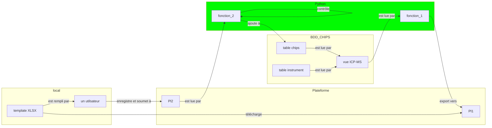

# CHIPS
> *CHImie en PaléoSidérurgie*

<p align="center">
  
  <br>
    <em>CHIPS le 18/02/25</em>
</p>

voir [Python Jupyter NB](https://colab.research.google.com/drive/1EHUO9JaBNLIyNdiHLCTtPAODgFhEvgcq#scrollTo=umLAT9DA2efl)

## BBD
> Postgres 11, PostGis v2.5

BDD Postgres hebergée sur les serveurs d'Huma-Num

### Tables

#### chips

La table `chips` est la table principale pour le stockage des données brutes et traitées des analyses physico-chimiques.

* description des champs: [chips_template_fields.tsv](https://github.com/zoometh/iramat-test/blob/main/dbs/chips/data/reference_data/chips_template_fields.tsv)


### Vues
> *Views*

| préfixes    | description                         |
|-------------|-------------------------------------|
| dataset_*   |   jeux de données originaux         |
| figarticle_*   |   données pour la création de graphiques         |
| instrument_*   |   données sur le parc instrumental du labo         |

#### Liste

##### Dataset

__template__

Par example pour le datataset `gpages22` (numéro de la référence bibliographique = `2`), en SQL embarqué dans Python (v. [Jupyter NB](https://colab.research.google.com/drive/1EHUO9JaBNLIyNdiHLCTtPAODgFhEvgcq#scrollTo=7K_YGRJabl7u)):

```py
dataset_name = 'dataset_gpages22'
bibreference_num = 'c.bibreference = 2'
my_view = f"""
CREATE OR REPLACE VIEW public.{dataset_name}
 AS
 SELECT s.nom_site AS site_name,
    c.id_chips,
    s.longitude,
	  s.latitude,
    e.nom_ech AS sample_name,
    (typo.categorie_en || ' '::text) || typo.sous_categorie_en AS typology,
    c.na,
    c.mg,
    c.al,
    c.si,
    c.p,
    c.s,
    c.cl,
    c.k,
    c.ca,
    c.mn,
    c.fe,
    c.perte_feu AS loi,
    c.ag,
    c.arsenic,
    c.ba,
    c.be,
    c.bi,
    c.cd,
    c.ce,
    c.co,
    c.cr,
    c.cs,
    c.cu,
    c.dy,
    c.er,
    c.eu,
    c.delta56fe AS deltafe56,
    c.delta57fe AS deltafe57,
    c.ga,
    c.gd,
    c.ge,
    c.hf,
    c.ho,
    c.indium,
    c.la,
    c.li,
    c.lu,
    c.mo,
    c.nb,
    c.nd,
    c.ni,
    c.os_ppt AS os,
    c.os187_os188,
    c.os187_os186,
    c.pb,
    c.pd,
    c.pr,
    c.rb,
    c.ru,
    c.sb,
    c.sc,
    c.se,
    c.sm,
    c.sn,
    c.sr,
    c.sr87_sr86,
    c.ta,
    c.tb,
    c.te,
    c.th,
    c.ti,
    c.tl,
    c.tm,
    c.u,
    c.v,
    c.w,
    c.y,
    c.yb,
    c.zn,
    c.zr,
    m.methode_analyse AS major_method,
    (((m.laboratoire || ' - '::text) || m.marque) || ' '::text) || m.modele AS major_analytical_setup,
    m.methode_analyse AS trace_method,
    (((m.laboratoire || ' - '::text) || m.marque) || ' '::text) || m.modele AS trace_analytical_setup,
    (((((((l.authors::text || ' ('::text) || l.pub_year) || '), '::text) || l.title::text) || ', '::text) || l.journal_book::text) || ', '::text) || l.volume AS reference,
    l.url
   FROM chips c,
    echantillons e,
    sites s,
    typo,
    personnes,
    gadm,
    machines m,
    literature l
  WHERE c.id_ech = e.id_ech AND e.id_site = s.id_site AND e.id_typo = typo.id_typo AND e.referent = personnes.id_personne AND s.id_localite = gadm.uid AND c.id_machinem = m.id_dispositif AND c.bibreference = l.id_lit AND {bibreference_num}
  ORDER BY (ROW(s.nom_site, e.nom_ech));

ALTER TABLE public.{dataset_name}
    OWNER TO postgres;

GRANT ALL ON TABLE public.{dataset_name} TO postgres;
GRANT SELECT ON TABLE public.{dataset_name} TO web_anon;
"""
```

## Flux de travail



: fichiers/fonctions Python

* `contrôle`
  1. vérification des données saisies dans l'XLSX (types attendus, etc.)


* `ajoute à`:
  1. effectue un `INSERT INTO` dans la table chips avec auto-incrémentation des indenfiants ❓updates
  2. retourne un rapport: identifiants, etc. ❓Zenodo

#### _refbib

La table `_refbib` regroupe les références bibliographiques des différentes vues (*views*). Ces références sont au format BibTeX et seront mappées pour correspondre aux champs de Zenodo (table de correspondance [bibtex2zenodo.tsv](https://github.com/zoometh/iramat-test/blob/main/projects/citation/bibtex2zenodo.tsv))

* structure

| champs          | description                         |
|-----------------|-------------------------------------|
| ref_table       |  le nom de la table ou de la vue qui sera référencée par la référence bibliographique                             |
| ref_biblio      |  la référence bibliographique au format texte                           |


* ajouter

```sql
INSERT INTO _refbib (ref_table, ref_biblio)
VALUES ('instrument_incertitude','@techreport{Doe2024TechReport,
  author      = {John Doe and Jane Smith},
  title       = {A Comprehensive Guide to Dummy Data Processing},
  institution = {Institute of Advanced Computing},
  year        = {2024},
  number      = {TR-2024-001},
  address     = {New York, USA},
  month       = {February},
  note        = {Available online at \url{https://example.com/techreport}},
}');
```

### à classer

* https://zoometh.xyz/dash/dataset_adisser17 : Forbidden. You don't have permission to access this resource (temp)
* https://zoometh.xyz/dash/dataset_gpages22 : Forbidden. You don't have permission to access this resource (temp)
* https://zoometh.xyz/dash/dataset_vserneels93 : id.
* ... : id.
* https://zoometh.xyz/dash/dataset_amdesaulty8b : manque refs
* https://zoometh.xyz/dash/dataset_gstdidier17 : id.
* https://zoometh.xyz/dash/dataset_mbrauns13 : pas ouverte?
* etc.

### notes
  
| id_machinei         | integer   |                     |  analytical setup used to acquire isotopic amounts                |  
| id_machinem         | integer   |                     |  analytical setup used to measure major elements                |  
| id_machinet         | integer   |                     |  analytical setup used to measure trace elements                |  
