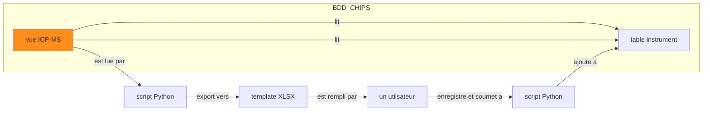

# CHIPS
> *CHImie en PaléoSidérurgie*

<p align="center">
  
  <br>
    <em>CHIPS le 18/02/25</em>
</p>

voir [Python Jupyter NB](https://colab.research.google.com/drive/1EHUO9JaBNLIyNdiHLCTtPAODgFhEvgcq#scrollTo=umLAT9DA2efl)

## BBD

BDD Postgres hebergée sur les serveurs d'Huma-Num

### Tables

#### chips

La table `chips` est la table principale pour le stockage des données brutes et traitées des analyses physico-chimiques.

* ajouter

## Flux de travail



: ma légende  

#### _refbib

La table `_refbib` regroupe les références bibliographiques des différentes vues (*views*). Ces références sont au format BibTeX et seront mappées pour correspondre aux champs de Zenodo (table de correspondance [bibtex2zenodo.tsv](https://github.com/zoometh/iramat-test/blob/main/projects/citation/bibtex2zenodo.tsv))

* structure

| champs          | description                         |
|-----------------|-------------------------------------|
| ref_table       |  le nom de la table ou de la vue qui sera référencée par la référence bibliographique                             |
| ref_biblio      |  la référence bibliographique au format texte                           |


* ajouter

```sql
INSERT INTO _refbib (ref_table, ref_biblio)
VALUES ('instrument_incertitude','@techreport{Doe2024TechReport,
  author      = {John Doe and Jane Smith},
  title       = {A Comprehensive Guide to Dummy Data Processing},
  institution = {Institute of Advanced Computing},
  year        = {2024},
  number      = {TR-2024-001},
  address     = {New York, USA},
  month       = {February},
  note        = {Available online at \url{https://example.com/techreport}},
}');
```

### notes
  
| id_machinei         | integer   |                     |  analytical setup used to acquire isotopic amounts                |  
| id_machinem         | integer   |                     |  analytical setup used to measure major elements                |  
| id_machinet         | integer   |                     |  analytical setup used to measure trace elements                |  
