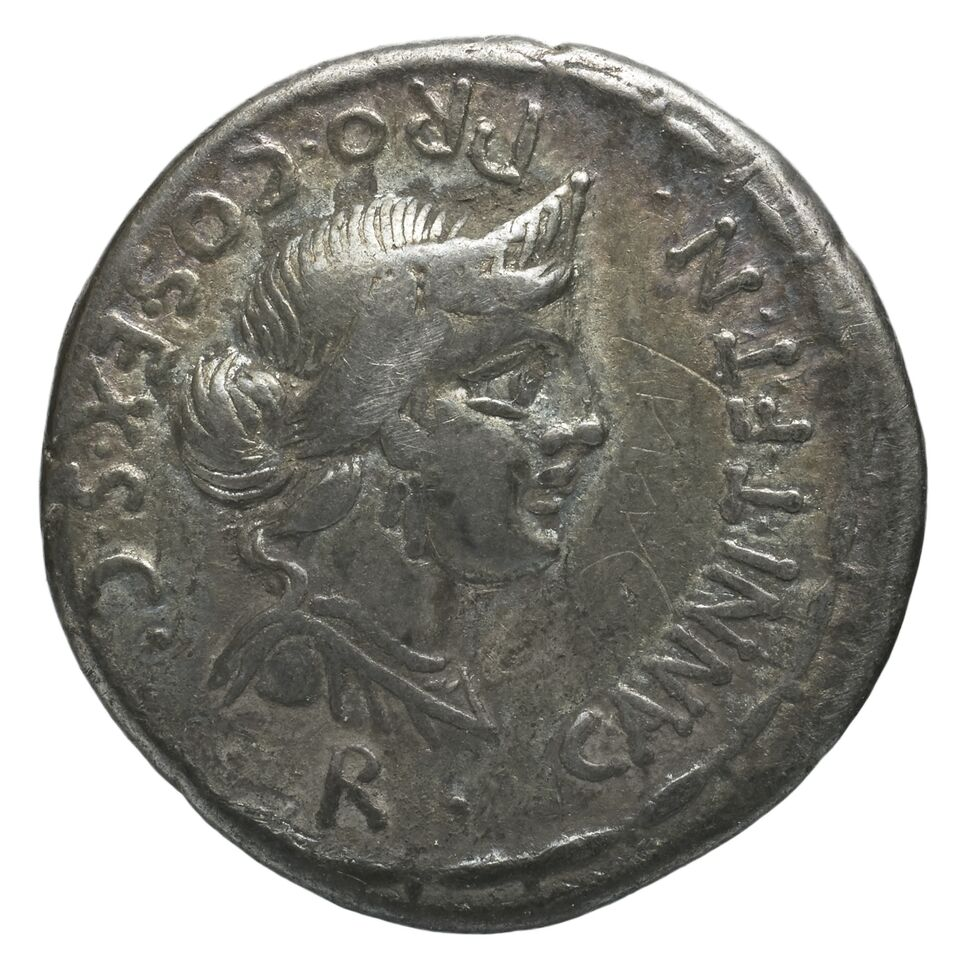

## Tests IIIF sur Gallica

  
   
  <em><a href="https://gallica.bnf.fr/iiif/ark:/12148/btv1b104536783/f1/full/970,/0/native.jpg">native.jpg</a> telechargee depuis Gallica avec l'annotation <a href="./btv1b104536783/annotations.json">annotations.json</a></em>

