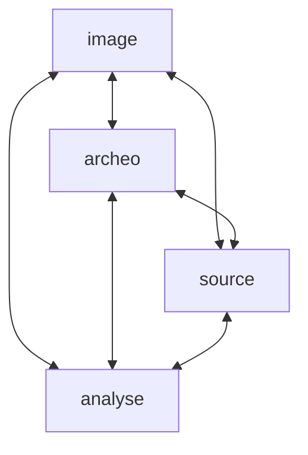

# OCC

## Bonnes pratiques

* Utiliser l'API de la BnF on peut récupérer des informations. Exemple, références bibliographiques d'un document: https://gallica.bnf.fr/services/OAIRecord?ark=btv1b104536783

## Etapes

1. Aligner la BDD AeMA sur les concepts de Nomisma
    - ~~Forum~~: ~~Wikiproject~~, ~~GitHub Issues (or Discussions) ~~
    - Régions

2. ...
3. Création d'une API
4. Création d'un SPARQL *endpoint*

### Alignement BDD AeMA -> Nomisma

Templates Nomisma

| Nomisma | Column 2 | Column 3 |
|----------|----------|----------|
| [Denominations](https://docs.google.com/spreadsheets/d/1RrQ9XRR4MQRVtzL3tay4ronK6vzAuI8yHBcyD-FRrYo/edit?usp=sharing)    | Data A   | Data B   |
| [People](https://docs.google.com/spreadsheets/d/1mPiUIdUCkRdx8fhdSuslyIxyz1dYiLsS1CetyOEkxn0/edit?usp=sharing)    | Data A   | Data B   |
| [Corporate authorities, "tribes"](https://docs.google.com/spreadsheets/d/1ntf1lLsxLwkNR0rKxPGzG0tvc73Z4Z9-ft21UdRKRmo/edit?usp=sharing)    | Data A   | Data B   |
| [Regions](https://docs.google.com/spreadsheets/d/1j0wgE1GSPHLlzsQDOJUtmrE62CP_3Dio-aHRsfHAOdY/edit?gid=0#gid=0)    | Data A   | Data B   |

## MCD

