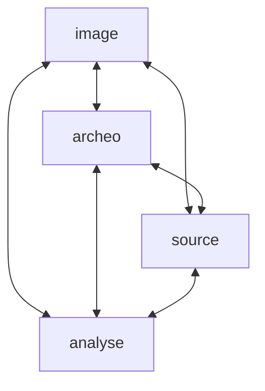

# OCC

## Bonnes pratiques

* Utiliser l'API de la BnF on peut récupérer des informations. Exemple, références bibliographiques d'un document: https://gallica.bnf.fr/services/OAIRecord?ark=btv1b104536783

## Etapes

1. Aligner la BDD AeMA sur les concepts de Nomisma
    - Forum: ~~Wikiproject~~, GitHub Issues (or Discussions) 
2. ...
3. Création d'une API
4. Création d'un SPARQL *endpoint*

## MCD

