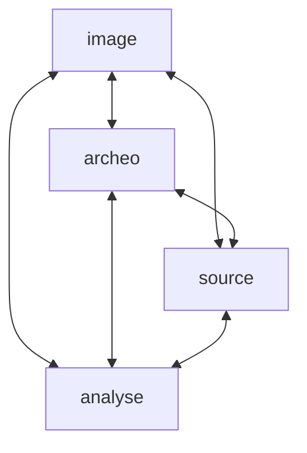

# OCC

## Bonnes pratiques

* Utiliser l'API de la BnF on peut récupérer des informations. Exemple, références bibliographiques d'un document: https://gallica.bnf.fr/services/OAIRecord?ark=btv1b104536783

## MCD

