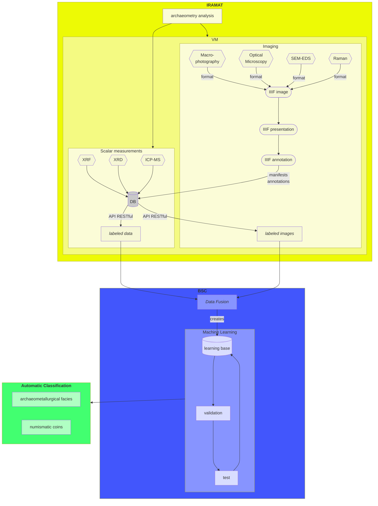

## Worflow

## Examples

### VM

Ubuntu 22.04 LTS Virtual Machine, hosted by the [Université of Paris-Saclay Mésocentre](https://mesocentre.universite-paris-saclay.fr/)

### DB

- [CHIPS (Chimie en PaléoSidérurgie) Database](https://iramat-apps.cnrs.fr/dash/)

### IIIF

#### IIIF image

- [info.json example](https://iramat-apps.cnrs.fr/iiif/2/acies%2FSeax_sample_process.tif/info.json)
- [Cantaloupe example](https://iramat-apps.cnrs.fr/iiif/2/acies%2FSeax_sample_process.tif/full/full/0/default.jpg)

#### IIIF presentation

- [Manifest example](https://iramat-apps.cnrs.fr/iiif/manifest_seax.json)
- ~~[Mirador image example](https://iramat-apps.cnrs.fr/page/puddled.html)~~
- [Mirador image example](https://jpadfield.github.io/simple-mirador/Standard_Example.html)

#### IIIF annotation

- [TODO]()