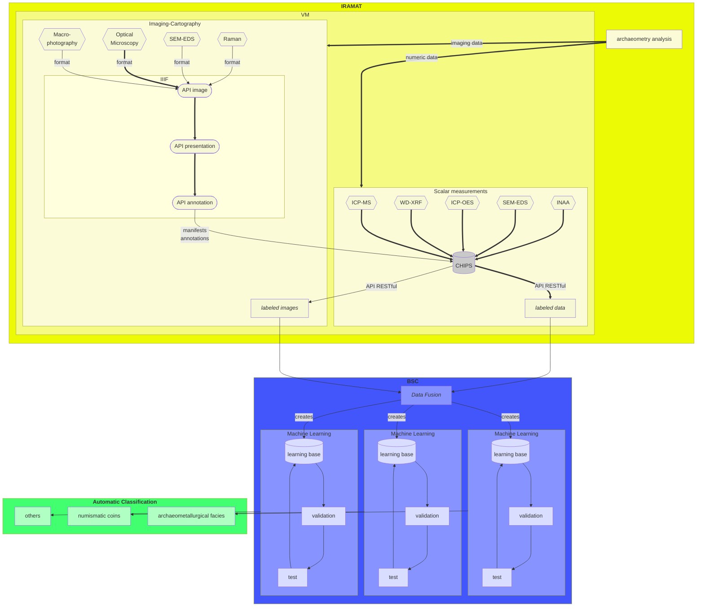

## Worflow

```mermaid
flowchart TD
  subgraph IRAMAT[<b>IRAMAT</b>]
  	ICP-MS{{ICP-MS}}
  	WD-XRF{{WD-XRF}}
	  ICP-OES{{ICP-OES}}
    SEM-EDS{{SEM-EDS}}
    INAA{{INAA}}
    BD[(CHIPS)]
    analyses[archaeometry analysis]
    analyses == numeric data ==> IRAMATdata
    analyses == imaging data ==> IRAMATimg
	subgraph VM[VM]
    subgraph IRAMATdata[Scalar measurements]
        ICP-OES ==> BD
        WD-XRF ==> BD
        SEM-EDS ==> BD
        ICP-MS ==> BD
        INAA ==> BD
        BD == API RESTful ==> APIdata[<em>labeled data</em>]
    end
    subgraph IRAMATimg[Imaging-Cartography]
        Macro{{Macro-<br>photography}} -- format --> IIIFimg([API image])
        Opt{{Optical<br>Microscopy}} == format ==> IIIFimg
        SEM{{SEM-EDS}} -- format --> IIIFimg
        Raman{{Raman}} -- format --> IIIFimg
        subgraph IRAMATiiif[IIIF]
          IIIFimg ===> IIIFpres([API presentation])
		      IIIFpres ===> IIIFannot([API annotation])
        end
		    IIIFannot -- manifests<br>annotations --> BD
        BD -- API RESTful --> APIimg[<em>labeled images</em>]
    end
	end
  end
  APIdata ---> PyExtract[<em>Data Fusion</em>]
  APIimg ---> PyExtract
  subgraph BSC[<b>BSC</b>]
    PyExtract -- creates --> MLlearn1[(learning base)]
    subgraph ML1[Machine Learning]
      MLlearn1 ---> MLvalid1[validation]
      MLvalid1 ---> MLtest1[test]
      MLtest1 --> MLlearn1
    end
    PyExtract -- creates --> MLlearn2[(learning base)]
    subgraph ML2[Machine Learning]
      MLlearn2 ---> MLvalid2[validation]
      MLvalid2 ---> MLtest2[test]
      MLtest2 --> MLlearn2
    end
    PyExtract -- creates --> MLlearn3[(learning base)]
    subgraph ML3[Machine Learning]
      MLlearn3 ---> MLvalid3[validation]
      MLvalid3 ---> MLtest3[test]
      MLtest3 --> MLlearn3
    end
  end
    subgraph out[<b>Automatic Classification</b>]
      ResMet[archaeometallurgical facies]
      ResNum[numismatic coins]
      ResVaria[others]
    end
  ML1 ---> ResMet
  ML2 ---> ResNum
  ML3 ---> ResVaria

style BD fill:#cccccc

style IRAMAT fill:#edfa05
style VM fill:#f4fa82
style analyses fill:#fbfcd7
style IRAMATdata fill:#fbfcd7
style IRAMATimg fill:#fbfcd7
style ICP-OES fill:#f6f7d5
style WD-XRF fill:#f6f7d5
style SEM-EDS fill:#f6f7d5
style ICP-MS fill:#f6f7d5
style INAA fill:#f6f7d5
style Macro fill:#f6f7d5
style Opt fill:#f6f7d5
style SEM fill:#f6f7d5
style Raman fill:#f6f7d5
style IIIFimg fill:#f6f7d5
style IIIFpres fill:#f6f7d5
style IIIFannot fill:#f6f7d5
style BD fill:#c9c9c9
style APIdata fill:#f6f7d5
style APIimg fill:#f6f7d5

style BSC fill:#4256fc
style PyExtract fill:#8794ff
style ML1 fill:#8794ff
style MLlearn1 fill:#d9ddff
style MLvalid1 fill:#d9ddff
style MLtest1 fill:#d9ddff
style ML2 fill:#8794ff
style MLlearn2 fill:#d9ddff
style MLvalid2 fill:#d9ddff
style MLtest2 fill:#d9ddff
style ML3 fill:#8794ff
style MLlearn3 fill:#d9ddff
style MLvalid3 fill:#d9ddff
style MLtest3 fill:#d9ddff

style out fill:#42ff70
style ResMet fill:#b0ffc3
style ResNum fill:#b0ffc3
style ResVaria fill:#b0ffc3

click BD "https://iramat-apps.cnrs.fr/dash/"
click VM "https://iramat-apps.cnrs.fr/portal/"
click APIdata "https://iramat-apps.cnrs.fr/api/dataset_pdillmann17"
click IIIFimg "https://iramat-apps.cnrs.fr/go/barre531-iiif"
click IIIFpres "https://iramat-apps.cnrs.fr/view/_test/barre531_compare.html"
click IIIFannot "https://iramat-apps.cnrs.fr/portal/catalogue/facies%253A123456789.html"
```

