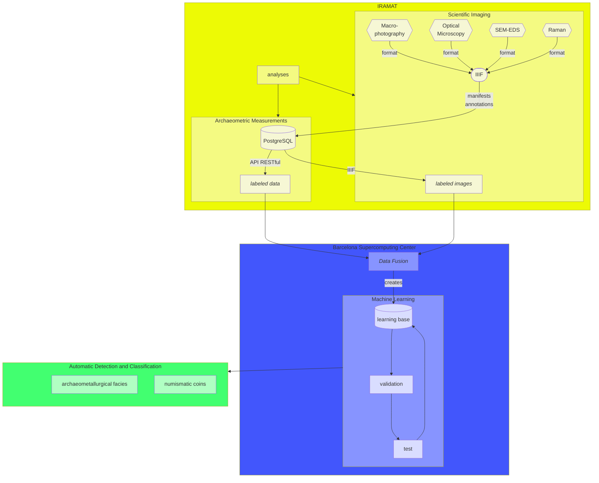

## Worflow

```mermaid
flowchart TD
  subgraph IRAMAT[IRAMAT]
    direction TB
    IRAMAT_spacer[" "]:::spacer

    BD[(PostgreSQL)]
    analyses
    analyses --> IRAMATdata
    analyses --> IRAMATimg

    subgraph IRAMATdata[Archaeometric Measurements]
        direction TB
        IRAMATdata_spacer[" "]:::spacer

        BD -- API RESTful --> APIdata[<em>labeled data</em>]
    end

    subgraph IRAMATimg[Scientific Imaging]
        direction TB
        IRAMATimg_spacer[" "]:::spacer

        Macro{{Macro-<br>photography}} -- format --> IIIF([IIIF])
        Opt{{Optical<br>Microscopy}} -- format --> IIIF
        SEM{{SEM-EDS}} -- format --> IIIF
        Raman{{Raman}} -- format --> IIIF
        IIIF -- manifests<br>annotations --> BD
        BD -- IIIF --> IIIFmanifest[<em>labeled images</em>]
    end
  end

  APIdata ---> PyExtract[<em>Data Fusion</em>]
  IIIFmanifest ---> PyExtract

  subgraph BSC[Barcelona Supercomputing Center]
    direction TB
    BSC_spacer[" "]:::spacer

    PyExtract -- creates --> MLlearn[(learning base)]
    subgraph ML[Machine Learning]
      direction TB
      ML_spacer[" "]:::spacer

      MLlearn ---> MLvalid[validation]
      MLvalid ---> MLtest[test]
      MLtest --> MLlearn
    end
  end

  subgraph out[Automatic Detection and Classification]
    direction TB
    out_spacer[" "]:::spacer

    ResMet[archaeometallurgical facies]
    ResNum[numismatic coins]
  end

  ML ---> out

  classDef spacer fill:transparent,stroke:transparent,color:transparent;

  style BD fill:#cccccc

  style IRAMAT fill:#edfa05
  style analyses fill:#f4fa82
  style IRAMATdata fill:#f4fa82
  style IRAMATimg fill:#f4fa82
  style Macro fill:#f6f7d5
  style Opt fill:#f6f7d5
  style SEM fill:#f6f7d5
  style Raman fill:#f6f7d5
  style IIIF fill:#f6f7d5
  style IIIFmanifest fill:#f6f7d5
  style BD fill:#f6f7d5
  style APIdata fill:#f6f7d5

  style BSC fill:#4256fc
  style PyExtract fill:#8794ff
  style ML fill:#8794ff
  style MLlearn fill:#d9ddff
  style MLvalid fill:#d9ddff
  style MLtest fill:#d9ddff

  style out fill:#42ff70
  style ResMet fill:#b0ffc3
  style ResNum fill:#b0ffc3

```