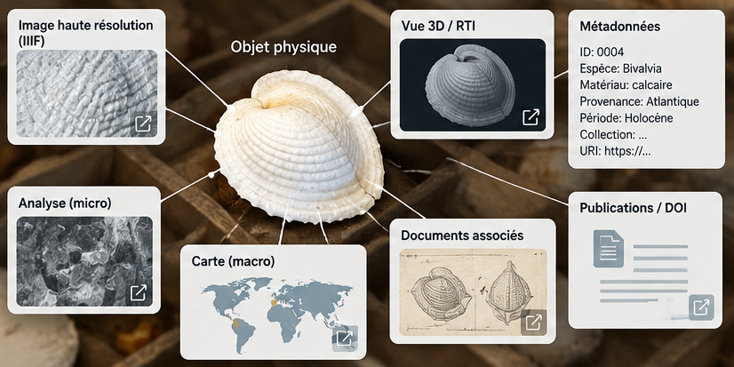

## *Collection as Data*, de la reproduction à l'information

La digitalisation des collections des musées, bibliothèques et archives, à l'heure de l'avènement des technologies du Web, demande de repenser le partage des informations liées aux collections, en considérant celles-ci, prioritairement, comme des ensembles de données pouvant être interrogés, reliés et réutilisés (mouvement *Collections as Data*[^1] et *datafication*). Dans l'espace européen de la recherche en histoire, histoire de l'art et archéologie, les producteurs de données sont parallèlement incités à suivre les principes de la Science ouverte et les principes FAIR — Facile à trouver, Accessible, Interopérable et Réutilisable — en privilégiant notamment des logiciels libres, des protocoles communs et des formats ouverts.

À partir de l'exemple d'une collection de monnaies actuellement étudiée à l'IRAMAT dans le cadre du projet ALMACIR, je montrerai comment peuvent s'articuler la description des objets (Numishare/XML et Nomisma), la fédération et la visualisation des données et des images (API et IIIF), leur archivage et leur citation (Zenodo), ainsi que la gestion du projet et de ses développements (GitHub), tout en évoquant les perspectives liées au développement d'un CMS sous Omeka S.

Plus généralement, il s'agira de montrer comment le passage de la reproduction et de la visualisation numériques des collections à la *datafication* de l'information conduit également à repenser la chronologie de la publication scientifique : du *data paper* et de la publication des données aux interfaces de consultation et aux articles de recherche qui les exploitent.

[^1]: https://collectionsasdata.github.io/
